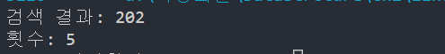
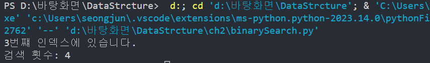

# 알고리즘 

🧊 알고리즘이란 단순히 문제를 해결하는 절차

## 2.1 정렬된 배열
🧊 항상 순서대로 있어야 한다는 점 

배열 [3,17,80,202]에 75를 삽입해보자 
일반적인 배열은 75를 끝에 삽입할 것이다. 
[3,17,80,202,75]

반면 정렬된 배열에서는 값을 오름차순으로 유지하려면 
적절한 위치에 75를 삽입해야 한다. 
[3,17,75,80,202]
컴퓨터는 75를 배열에 한번에 넣으려면 작업을 한 단계로 
처리할 수 없다. 먼저 75가 들어갈 위치를 찾고 이후에 다른 값들을 옮겨 빈 공간을 만들어야 한다. 

1단계: 인덱스 0의 값을 확인해서 삽입하려는 값인 75가 왼쪽으로 들어갈지 오른쪽으로 들어갈지 정한다. 
[3,17,80,202]
 ⬆

2단계: 75는 3보다 크므로 오른쪽에 삽입해야 한다 그럼 다음 셀의 값을 확인한다. 
[3,17,80,202]
   ⬆

3단계: 17은 컸으니 다음 셀의 값을 확인 해본다. 80이다 75를 80셀 왼쪽으로 데이터를 넣으려면 80을 옮겨야 한다. 
[3,17,80,202] 
      ⬆

4단계: 마지막 값을 오른쪽으로 옮긴다.      
[3,17,80,  ,202] 
          ➡

5단계: 마지막 앞에 있던 값을 오른쪽으로 옮긴다.       
[3,17,  ,80,202] 
        ➡       

6단계: 75를 올바른 위치에 삽입한다. 
[3,17,75,80,202] 
      ⬆        

총 6번 횟수가 걸렸다. 정렬된 배열에 삽입할 때는 실제 삽입 전에 검색을 먼저 수행해서 
삽입할 올바른 위치를 정해야 함을 알 수 있다. 삽입에 있어 정렬된 배열이 일반 배열보다 덜 효율적이지만
정렬된 배열의 강력함은 연산에서 드러난다. 

## 2.2 정렬된 배열의 검색 
🧊 선형 검색은 원하는 값을 찾을 때가지 왼쪽에서 오른쪽으로 한 번에 한 셀씩 확인하는 방법이다. 

🧊 선형 검색
배열 vs 정렬된 배열

1. 배열 [17,3,75,202,80] 
22라는 값을 찾으려면 모든 원소를 하나도 빠짐없이 다 검색해야 한다. 

2. 배열 [3,17,75,80,202] 
22라는 값을 찾다가 75에 도달하면 더 이상 22가 오른쪽에 있을 수 없으므로 바로 검색을 중단할 수 있다. 

✅ 이러한 관점에서 볼 때 선형 검색은 대부분의 경우 일반 배열보다 정렬된 배열에서 단계 수가 적게 걸린다. 

📀 정렬된 배열이 배열보다 크게 두드러진 장점은 다른 검색 알고리즘을 쓸 수 있으며 
   이러한 알고리즘을 이진 검색이라고 부른다. 속도도 선형 검색보다 훨씬 빠르다.

### 🧪 실습

## 2.3 이진 검색 

🧊 이진 검색 예시 

🙅🏻‍♂️ 나: 내가 생각하고 있는 수를 맞춰봐! 1~10 사이야
🙋🏻‍♂️ 친구: 5! 
🙅🏻‍♂️ 나: 커 
🙋🏻‍♂️ 친구: 8! 
🙅🏻‍♂️ 나: 작아 
🙋🏻‍♂️ 친구: 6!
🙅🏻‍♂️ 나: 커
🙋🏻‍♂️ 친구: 7!
🙆🏻‍♂️ 나: 맞췄어! 

✅ 이게 바로 이진 검색이다.
⏩ 배열에 값의 순서가 엉망이면 이진 검색을 할 수 없기 때문에 정렬된 배열은 이진 검색을 수행할 수 있다. 

🧊 실제 예제 9개의 원소를 포함하는 정렬된 배열이며 값 7을 찾는다고 가정하자 
[?,?,?,?,?,?,?,?,?]

1단계: 가운데 셀부터 검색을 시작한다. 배열의 길이를 알고 있으므로 가운데 셀에 쉽게 접근할 수 있고 
       길이를 2로 나누면 적절한 메모리 주소로 바로 이동할 수 있다. 값 9 
[?,?,?,?,9,?,?,?,?]
         ⬆
값이 9로 들어났으므로 7은 왼쪽 어딘가에 있다고 판단 할 수 있다. 
즉 9보다 오른족에 있는 모든 셀을 제거했다 
[?,?,?,?,9,❌,❌,❌,❌]

2단계: 9보다 왼쪽에 있는 셀들 중 가운데 값을 확인한다. 가운데 값이 두개이므로 임의로 왼쪽 값을 선택한다. 
[?,4,?,?,9,❌,❌,❌,❌] 
   ⬆
값은 4로 들어났으므로 7은 오른쪽 두개 ?에 있어야 한다 4와 왼쪽 셀을 제거한다. 
[❌,4,?,?,9,❌,❌,❌,❌] 

3단계: 7일 수 있는 셀이 두개 남았다. 임의로 왼쪽 셀을 선택한다. 
[❌,4,6,?,9,❌,❌,❌,❌] 
      ⬆

4단계: 마지막 남은 셀을 확인한다. (여기에 7이 없다면 이 정렬된 배열에는 7이 없다는 뜻)
[❌,4,6,7,9,❌,❌,❌,❌] 
        ⬆

4단계 만에 7을 성공적으로 찾았다. 

### 🧪 실습

## 2.4 이진 검색 대 선형 검색 

100개의 값을 갖는 배열에서 각 검색에 필요한 최대 단계 수는 다음과 같다. 

    ✅ 선형 검색: 100단계
    ✅ 이진 검색: 7단계 
 
선형 검색에서 찾고 있는 값이 마지막 셀에 있거나 마지막 셀의 값보다 크면 모든 원소를 조사해야 한다. 
이진 검색은 추측할 때마다 검색해야 할 셀 중 절반을 제거할 수 있어 첫 번째 추측에서 셀을 50개나 제거해버린다. 

정렬된 배열에서 항목의 개수를 두 배로 늘릴 때마다 이진 검색에 필요한 단계 수가 1씩 증가하는 패턴이 보인다! 
효율적인 패턴으로 데이터를 두 배로 늘릴 떄마다 이진 검색 알고리즘에서는 최대 한 단계만 더 추가된다. 

🧊 선형 검색 대조 
원소 3개가 있으면 최대 3단계
원소 7개가 있으면 최대 7단계
선형 검색은 원소 수만큼의 단계가 필요하다. 
배열의 원소 수를 두배로 늘릴 때마다 검색에 필요한 단계 수도 두배로 늘어난다. 

🍹 선형 검색과 이진 검색의 그래프 

## 2.5 마무리 
🧊 사용자가 선택하는 알고리즘이 코드의 속도에 크게 영향을 줄 수 있다. 
