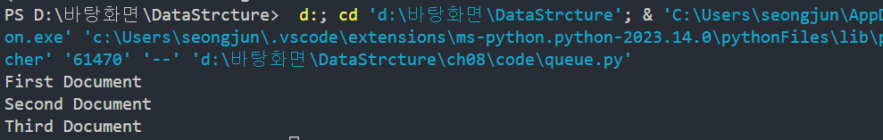

## 8.1 스택
🐠 스택이 데이터를 저장하는 방법은 배열과 같다.

📌 스택에는 세 가지 제약
 1. 데이터는 스택의 끝에만 삽입할 수 있음
 2. 데이터는 스택의 끝에서만 읽을 수 있음 
 3. 데이터는 스택의 끝에서만 삭제할 수 있음 

🐠 스택 새 값 삽입 => push
1. 5를 스택에 푸시 [5]
=> 배열 끝에 데이터를 삽입하는 것 
2. 3을 스택에 푸시 [3]
=> [5][3]
3. 다음으로 0을 스택에 푸시 
=> [5][3][0]
보다시피 데이터를 항상 스택의 위에 추가하고 있다. 
스택의 밑이나 중간에 0을 삽입하고 싶어도 데이터는 위에만 
추가할 수 있다는 스택의 특징 때문에 그럴 수 없다. 

🐠 스택 원소 제거 => pop 
1. 먼저 0을 pop 한다 [0]
[5][3]
2. 다음으로 3을 팝한다. 
[5]
3.이제 스택은 5만 포함한다. 

🧊 스택 연산을 묘사하는 데 쓰이는 유용한 두문자어가 
    "Last In, First Out"을 뜻하는 LIFO이다. 
    스택에 푸시된 마지막 항목이 스택에서 팝될 첫 번째 항목이라는 의미다. 

## 8.2 스택 다뤄보기
오래 사용할 데이터를 저장할 때는 스택을 사용하지 말고 
임시 데이터를 다뤄야 하는 다양한 알고리즘에서는 스택이 유용한 도구다 

✅ 예제 
1. (var x = 2;
⏩ 닫는 괄호가 없는 경우 => 문법 오류 타입 1 

2.  var x = 2;)
⏩ 여는 괄호가 앞에 나오지 않았는데 닫는 괄호가 나온 상태 => 문법 오류 타입 2 

3. (var x = [1,2,3)];
⏩ 닫는 괄호가 바로 앞에 나온 여는 괄호와 종류가 다를때 => 문법 오류 타입 3 

1. 괄호가 아닌 모든 문자는 무시하고 넘어간다. 
2. 여는 괄호가 나오면 스택에 푸시한다. 스택에 넣는다는 것은 이 괄호가
    닫히기를 기다린다는 의미
3. 닫는 괄호가 나오면 스택 위에 원소를 확인 
    => 스택에 원소가 없으면 닫는 괄호에 대응하는 여는 괄호가 앞에 나오지 않은 것 - 문법 오류 타입 2 
    => 스택에 데이터는 있지만, 닫는 괄호가 스택 위에 있는 원소와 괄호 종류가 다르면 - 문법 오류 타입 3 
    => 닫는 괄호가 스택 위에 있는 원소와 괄호 종류가 같으면 여는 괄호를 성공적으로 닫았다는 뜻 
    => 줄 끝에 도달했는데 스택에 여전히 남아있는 괄호가 있다면 여는 괄호에 대응하는 닫는 괄호가 없다는 뜻 - 문법 오류 타입 1 

✅ 예제 동작
(var x = {y: [1,2,3]}) 

빈 스택을 준비한 후 각 문자를 왼쪽부터 오른쪽으로 읽기 시작 

1단계: 첫 번째 문자는 여는 소괄호 
(var x = {y: [1,2,3]}) 

2단계: 여는 괄호이므로 스택에 푸시 
( => [(] , var x=는 괄호 문자가 아니므로 무시 

3단계: 다음 여는 괄호가 나왔다 
(var x = {y:[1,2,3]})

4단계: { 스택에 푸시 
[(][{], y는 무시 

5단계: 여는 대괄호가 나왔다. 
(var x = {y: [1,2,3]})

6단계: 마찬가지로 스택에 추가 
[(][{][[], 1,2,3은 무시 

7단계: 닫는 괄호가 처음 나왔다. 닫는 대괄호 다. 

8단계: 스택 위를 검사한다. 여는 대괄호가 들어있다. 
       닫는 대괄호와 스택의 마지막 원소가 괄호 종류가 같으므로
       여는 대괄호를 스택에서 팝한다. 
[(][{]

9단계: 다음으로 닫는 중괄호가 나온다.
(var x = {y:[1,2,3]})

10단계: 여는 중괄호이므로 일치하는 괄호를 찾았다. 스택에서 중괄호를 팝한다. 
[(]

11단계: 닫는 괄호가 나왔다. 
(var x = {y:[1,2,3]})

12단계: 괄호 종류가 일치하므로 스택에서 팝 하면 이제 빈 스택이 된다. 

위 알고리즘을 구현해보자! 
class Linter:
    def __init__(self):
        self.stack = []
        self.error = None

    # 문법 오류 검사 ⛏ 
    def lint(self, text):

        for index, char in enumerate(text):
            # 문자가 여는 괄호면 스택에 푸시 
            if self.opening_brace(char):
                self.stack.append(char)
            elif self.closing_brace(char):
                # 문자가 닫는 괄호 문자가 최근에 나온 여는 괄호를 닫았다면 
                if self.closes_most_recent_opening_brace(char):
                    # 스택에서 해당 여는 괄호를 팝 
                    self.stack.pop()
                else:
                    # 닫는 괄호 문자가 최근에 나온 여는 괄호를 닫지 않음 
                    self.error = f"Incorrect closing brace: {char} at index {index}"
                    return

        if self.stack:
            # 스택이 비어있지 않는다면  
            # 대응하는 닫는 괄호가 나오지 않음 
            self.error = f"{self.stack[-1]} does not have a closing brace"

    def opening_brace(self, char):
        return char in ["(", "[", "{"]

    def closing_brace(self, char):
        return char in [")", "]", "}"]

    def opening_brace_of(self, char):
        return {")": "(", "]": "[", "}": "{"}[char]

    def most_recent_opening_brace(self):
        return self.stack[-1]

    def closes_most_recent_opening_brace(self, char):
        return self.opening_brace_of(char) == self.most_recent_opening_brace()

    
linter = Linter()
linter.lint("( var x = { y: [1, 2, 3] } )")
print(linter.error)

✅ 이렇게 하면 어떤 오류도 반환하지 않는다! => 문장이 올바름 

😑 마지막에 닫는 소괄호를 빼버리면 어떻게 될까? 

다음과 같은 오류 메세지를 얻는다.

## 8.3 큐
큐 역시 간결하게 임시 데이터를 다루며 제약이 있는 배열이라는 점에서 스택과 비슷하다 
큐는 First In, First Out의 약자인 FIFO로 표현 

🧊 제약사항 
1. 데이터는 큐의 끝에만 삽입할 수 있다.
2. 데이터는 큐의 앞에서만 읽을 수 있다.
3. 데이터는 큐의 앞에서만 삭제할 수 있다. 

1. 먼저 5를 삽입한다. 
[5]

2. 다음으로 9를 삽입한다.
[5][9]

3. 다음으로 100을 삽입한다.
[5][9][100]

✅ 스택과 동일했지만 
⏩ 하지만 큐의 앞에서부터 데이터를 삭제하므로 삭제는 역순이다.

4. 데이터 삭제 1 (5 삭제) 
[9][100]

5. 다음으로 9를 삭제 
[100]

이제 큐에서 원소가 100 하나 남았다. 

## 8.4 큐 다뤄보기

[✅] 큐 예제 
class PrintManager:
    def __init__(self):
        self.queue = []

    def queue_print_job(self, document):
        self.queue.append(document)

    def run(self):
        while self.queue:
            self.print(self.queue.pop(0))

    def print(self, document):
        print(document)

print_manager = PrintManager()
print_manager.queue_print_job("First Document")
print_manager.queue_print_job("Second Document")
print_manager.queue_print_job("Third Document")
print_manager.run()

🧊 출력

## 8.5 마무리
🤴🏻 마무으리! 이제 재귀 공부하러 가보자~  

