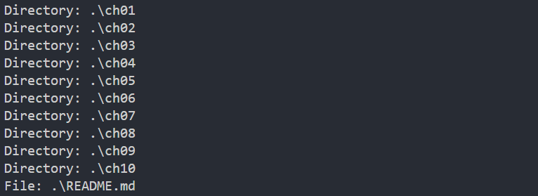
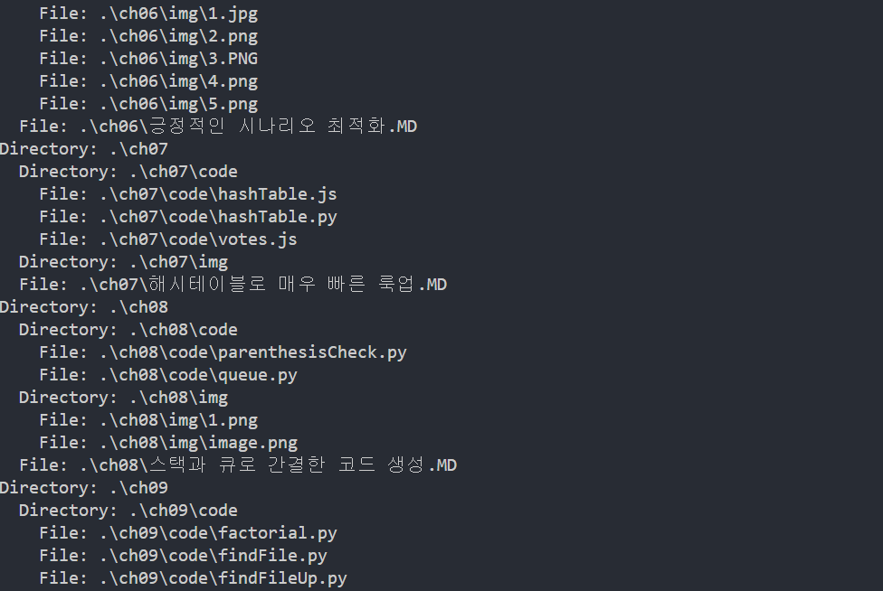
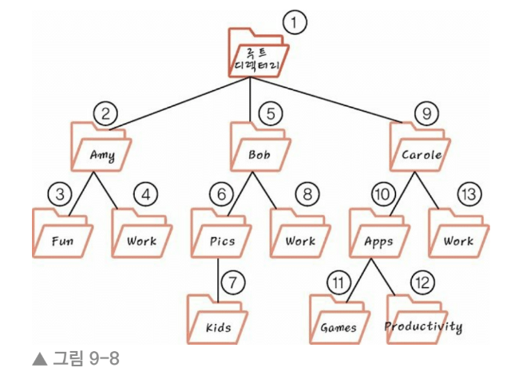

## 9.1 루프 대신 재귀
오 나 NASA 취직해서 우주선 발사에 쓰일 카운트 다운 함수를 구현해야해!!!! 
작성할 함수는 10과 같은 숫자를 받아 10부터 0까지 숫자를 표시해야 해 

function countdown(number) {

    for(var i = number; i>=0; i--){

        console.log(i);

    }

}

countdown(10)

좋아 이렇게 구현햇어 근데 말이야 루프가 꼭 필요할까? 

루프 대신에 재귀를 써보자 다음은 재귀로 구현해보자고 

function countdown(number) {

    if (number <= 0) {

        console.log("끝!");

    } 
    else {

        console.log(number);

        countdown(number - 1);
  
    }

}

countdown(10);

사실 책이랑 다르게 썻는데 책에 있는 코드를 쓰면 무한 굴레에 빠져서 수정했음 
if 로 number 0보다 같거나 작으면 탈출 할 수 있게 했고 아니면 계속해서 카운트 다운으로 
10 ~ 9 ~ ... 1 까지 카운트 다운 함수 호출해서 빠져 나갈거야 후 .. 

## 9.2 기저 조건
어라 내가 작성한 코드가 기저 조건에서 나오네... 흠 
그러네 책에서 나오네 사실 제공한 코드는 무한대로 음수를 출력하므로 완벽하지 않다! 
카운트 다운을 0에서 끝내고 재귀가 영원히 지속되는 방법을 막아보자고 합니다. 

number가 0이면 더 이상 countdown()을 호출하지 않는 조건문을 추가해서 문제를 해결! 
if (number === 0) {
    return;
}
else {
    countdown(number -1); 
}

countdown(10);

🧊 number가 0이면 코드는 countdown() 함수를 다시 호출하지 않고 반환만 하므로 다른 countdown()은 호출 x
    이러한 경우를 기저조건 base case, 중단 조건 이라 부른다. 

## 9.3 재귀 코드 읽기
이제 계승을 알아보자 
계승은 다음 예제로 가장 잘 설명된다. 
3*2*1 = 6 .. 오 이거 팩토리얼 함수 아니야? 
5의 계승은 다음과 같다.. 
5*4*3*2*1 = 120 

파이썬으로 구현해보자 

def factorial(number):

    if number == 1:

        return 1

    else:

        return number * factorial(number - 1) 

a = 5

print(factorial(a))

5를 팩토리얼 함수에 넣자 
조건은 5가 일이면 리턴 1이고 아니면 계속해서 
5 * factorial(5 - 1)이다. 그러면 1이 나올때까지 계속해서 4..3..2..1로 쭉 곱할 것이다. 
그러면 120이 나온다. 

## 9.4 컴퓨터의 눈으로 바라본 재귀
factorial method를 생각하면 factorial(3)을 호출할 때 다음과 같은 일이 일어난다. 
3을 호출하고 이 메서드가 끝나기 전에 2 호출... 2끝나기 전에 1 호출한다
컴퓨터는 1을 실행하는 동안 여전히 2와 3을 실행중인 것이다. 
컴퓨터는 스택을 사용해 어떤 함수를 호출 중인지 기록하는데 이러한 스택을 
목적에 딱 맞게 호출 스택이라 부른다. 

1. factorial (3) 을 호출 -> 호출 스택에 푸시 [factorial(3)]

2. factorial (2) 을 호출 -> 호출 스택에 푸시 [factorial(3)],[factorial(2)]

3. factorial (1) 을 호출 -> 1은 기저 조건으로 factorial 메서드를 호출하지 않고 끝남

4. 호출 스택에 데이터가 들어 있으므로 호출 스택 가장 위 원소를 가져와야 한다. 현재 (2)

5. 이제 호출 스택에서 factorial(2)를 팝한다. => [factorial(3)] => factorial(2) 실행 끝 

6. 이제 호출 스택에서 factorial(3)를 팝한다. =>  factorial(3) 실행 끝 => 재귀 끝 

📀 무한 재귀가 있을 때 프로그램은 컴퓨터 메모리에 더 이상 공간이 없을 때까지 계속해서 같은 메서드를 
    호출 스택에 푸시한다. 이로 인해 스택 오버플로라는 오류가 발생한다. 

## 9.5 재귀 다뤄보기
✅ 파일 시스템을 순회하는 예제를 만들어보자 

[🧊] 어떤 디렉터리 내에 있는 모든 파일에 대해 어떤 작업을 하는 스크립트가 있다고 하자. 
     하지만 하나의 디렉터리 내에 잇는 파일만 처리하는 스크립트가 아니라 그 디렉터리의 하위 디렉터리,
     그리고 하위 디렉터리의 하위 디렉터리에 있는 모든 파일에 대해 수행되길 원한다. 

     주어진 디렉터리의 모든 하위 디렉터리 명을 출력하는 간단한 루비? 아니 나 파이썬 쓴다. 

import os

def find(directory):

    for entry in os.scandir(directory):

        if entry.is_dir() and not entry.name.startswith((".", "..")):

            print("Directory:", entry.path)

        elif entry.is_file():

            print("File:", entry.path)

find(".")

[✅] 결과

📀 이 예제를 설명하면 os모듈을 사용해서 특정 디렉토리 내의 
    파일과 디렉토리를 탐색 및 출력 기능 수행
    for entry in os.scandir(directory):
    주어진 디렉토리 내 모든 항목 스캔, 각 항목을 entry 변수에 할당 
    if entry.is_dir() and not entry.name.startswith((".", "..")):
    print("Directory:", entry.path)
    entry가 디렉토리고 이름이 ., ..로 시작하지 않는 경우면 해당 디렉토리 경로 출력
    elif entry.is_file():
    print("File:", entry.path)
    entry가 파일이면 해당 파일의 경로를 출력한다! 

✅ 위의 코드도 좋지만 현재 디렉터리의 바로 아래에 있는 하위 디렉터리명만 출력...
    하위 디렉터리의 하위 디렉터리명은 출력하지 않음 좀 더 깊이 탐색할 수 있도록 해보자 

    import os

    def find(directory):

    for entry in os.scandir(directory):

        if entry.is_dir() and not entry.name.startswith((".", "..")):

            print("Directory:", entry.path)

        elif entry.is_file():

            print("File:", entry.path)

find(".")

계층 구조를 나타내도록 indent 변수를 추가 
for entry in os.scandir(directory):
디렉토리 항목들 순회 
if entry.is_dir() and not entry.name.startswith((".", "..")):
print(indent + "Directory:", entry.path)
항목이 디렉토리이면서 이름이 ., ..로 시작하지 않는 경우 들여쓰기랑 함께 경로 출력 
find(entry.path, indent + "  ")
더 깊이 탐색하기 위해 재귀 호출 => 들여쓰기 더 추가해서 계층 구조 표현 
elif entry.is_file():
print(indent + "File:", entry.path)
항목이 파일인 경우 파일 경로 출력 

[🧊] 결과

위 알고리즘이 파일 시스템 예제에 어떻게 적용되는지 시각적으로 확인하려면 그림 참고하자이 

10장에서는 재귀의 알고리즘 속도에 영향을 주는 핵심 요소가 될 수 있음을 기대해보자 

## 9.6 마무리
마무으리 
재귀를 안다는 것은 초인적인 힘이 생긴 것! 