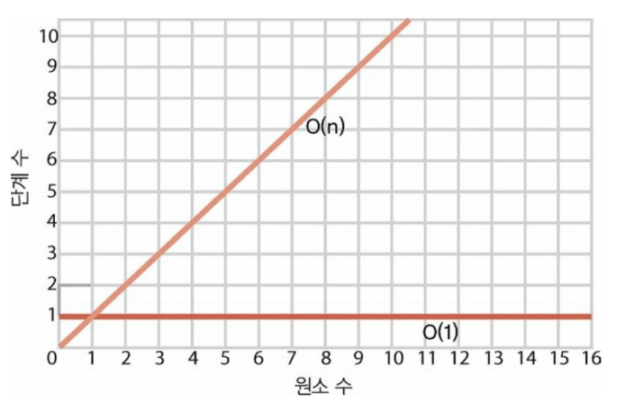
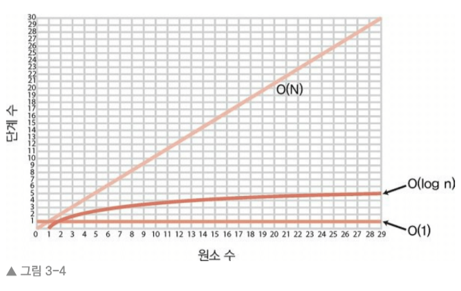

# 빅 오 표기법 
💿 빅 오 표기법은 알고리즘의 효율성을 표기해주는 표기법이다. 

## 3.1 빅오: 단계 수 계산 
O(1)은 데이터 크기에 상관없이 알고리즘에 필요한 단계 수가 일정하다는 의미 
배열 읽기는 배열에 얼마나 많은 데이터가 들어 있든 한 단계면 된다. 
O(1) 분류에 속하는 다른 연산으로는 배열 끝의 삽입과 삭제가 있다. 
두 연산에는 한 단계만 필요하므로 효율성을 O(1)이라 할 수 있다.

💿 선형 검색은 한 번에 한 셀씩 확인해서 배열에서 특정 값을 검색한다. 
   최악의 경우... 배열의 원소 수 만큼의 단계가 필요하다. 
   배열에 N개의 원소가 있을 때 선형 검색은 최대 N단계까지 걸릴 수 있다. 
   O(N) ➡ 선형 검색 

## 3.2 상수 시간과 선형 시간 
빅 오는 데이터가 증가할수록 단계 수는 어떻게 변하는가? 
O(N) 알고리즘은 데이터 원소 수만큼의 단계가 필요하다. 
따라서 배열에 원소 하나가 추가되면 O(N) 알고리즘은 한 단계 늘어난다. 
O(1) 알고리즘은 배열이 얼마나 커지든 단계 수가 같다. 

### 🧊 O(N)과 O(1) 그래프 

O(N)은 완벽한 대각선을 그림 => 데이터가 하나씩 추가될 때마다 알고리즘이 한 단계씩 더 걸린다. 
따라서 데이터가 많아질수록 알고리즘에 필요한 단계 수도 늘어난다. 
이러한 이유로 O(N)을 선형(linear time)이라고 부른다. 

O(1)은 알고리즘에 걸리는 단계 수가 항상 일정하기 때문에 O(1)을 상수 시간(constant time)이라고 부른다. 

빅 오는 본래 데이터 양이 변할 때 알고리즘의 성능이 어떻게 변하는가를 설명한다. 

🧊 O(1)은 데이터가 아무리 늘어나도 단계 수는 
   상수로 유지되므로 단계 수가 변하지 않는
   모든 알고리즘을 표헌하는 방법이다.
=> O(1)은 O(N)알고리즘보다도 더 효율적이라는 뜻이다.

## 3.3 같은 알고리즘, 다른 시나리오
전체적인 관점에서 선형 검색의 효율성을 설명한다면
최선의 시나리오에서는 O(1), 최악의 시나리오에서는 O(N)

## 3.4 세 번째 유형의 알고리즘 
데이터가 커질수록 단계 수가 늘어나므로 이진 검색은 O(1)이라 표현할 수 없다. 
이진 검색은 O(1) 과 O(N) 사이 어디쯤에 있다. 
빅 오는 이진 검색의 시간 복잡도를 ➡ O(log N)이라고 설명한다 
이러한 유형의 알고리즘을 로그 시간(log time)의 시간 복잡도라고 말한다. 

O(log N)은 데이터가 두 배로 증가할 때마다 한 단계씩 늘어나는 알고리즘을 설명하는 빅오의 방법이다. 

이 세 종류의 알고리즘을 비교하는 그래프를 보자 
🧊 O(1)
🧊 O(log N)
🧊 O(N)

🧊 O(log N)은 조금씩 증가하는 곡선을 그리고 있어 O(1)보다 덜효율적이지만 O(N)보다 훨씬 효율적이다 

## 3.5 logarithm 
로그는 로가리즘의 줄임말이다. 

✅ 로가리즘은 지수와 역(inverse)의 관계이다 
그럼 지수는 뭐였는지 기억해보잡 
2의 3승은 2*2*2와 동치로서 값이 8이다 

log2의8은 2의 3승으로 역이다. 

2를 세번 곱해야 8이 나오므로 log(2)8은 = 3이다. 

2의 6승은 64이다. 
log(2)64 = 6이다. 

## 3.6 O(log N) 해석 
O(log N)은 사실 O(log(2) N)을 줄여 부르는 말이다 

O(N)은 데이터 원소가 N개 있으면 알고리즘에서 N단계가 걸리는 뜻이다. 

O(log N)은 데이터 원소가 N개 있으면 알고리즘에서 log(2)N단계가 걸리는 뜻이다.
원소가 8개이면 log(2)8 이므로 알고리즘은 3단계가 걸린다. 

O(log N)은 원소가 하나가 될 때까지 데이터 원소를 계속해서 반으로 줄이는 만큼의 단계 수가 걸린다는 뜻이다.

원소 개수(N)       O(N)          O(log N)
  8                8               3
  16               16              4
  32               32              5
  64               64              6
  128              128             7
  256              256             8
  512              512             9
  1024             1024            10

O(N) 알고리즘에는 데이터 원소 수만큼의 단계가 필요한 반면, O(log N)알고리즘에는 
데이터 원소가 두 배로 늘어날 때마다 딱 한 단계만 필요하다.

## 3.7 실제 예제 
🧊 리스트 모든 항목 출력 예제   
things = ['apples', 'baboons','cribs','dulcimers']

for thing in things:
    print("Here's a thing: %s" % thing)

이 알고리즘의 효율성을 빅 오 표기법으로 어떻게 표현할 수 있을까? 
이 알고리즘은 원소 4개를 포함했으니깐 for 문 루프에서 4단계가 걸린다. 
😴 그럼 O(4) 일까? 아니다! 
😎 for문 루프에 원소 수만큼 단계가 걸리므로 이 알고리즘은 O(N)이다. 

🧊 print('Hello world!')
이 예제는 시간 복잡도가 O(1)이다. 

🧊 number의 나머지가 있는지 체크  
def is_prime(number):
    for i in range(2, number):
        if number % i == 0:
            return False
    return True 
이 예제는 number를 받아서 나머지가 있는지 체크한다 
나머지가 없으면 False를 반환하고 나머지가 있으면 True를 반환한다 
이 때 알고리즘의 효율성은 O(N)이다 
for문 루프가 받아오는 인자에 따라 정해지는 알고리즘이다. 

## 3.8 마무리
💿 빅 오 표기법으로 사용자의 코드를 더 빠르게 하고 더 큰 부하도 처리할 수 있는 방법을 알 수 있었다! 