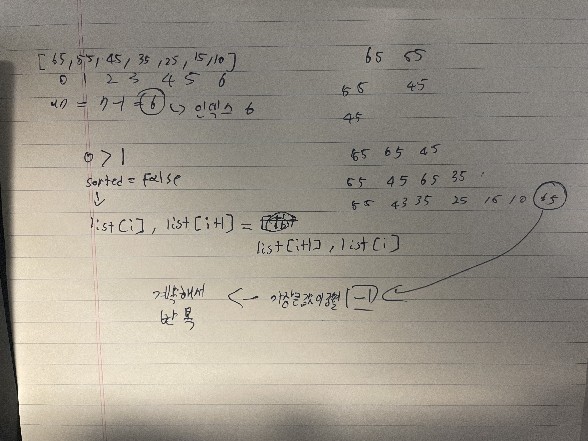
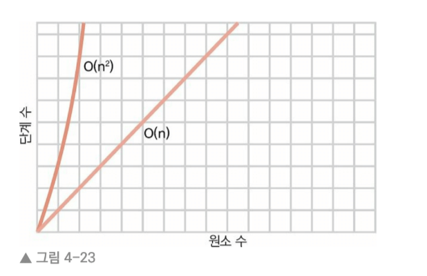
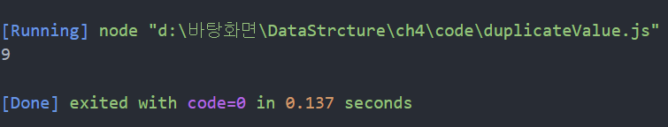
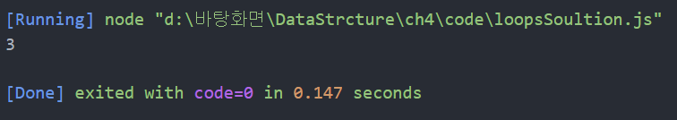

## 4.1 버블 정렬
정렬 알고리즘은 컴퓨터 과학 분야에서 폭넓게 연구된 주제이다. 

📀 bubble sort 단계
1. 배열 내에서 연속된 두 항목을 가라킨다 
   첫 번째 항목과 두 번째 항목을 비교한다. 
   [2][1][3][5]
    ⬆  ⬆

2. 두 항목의 순서가 뒤바뀌어 있으면(즉, 왼쪽 값이 오른쪽 값보다 크면) 
   두 항목을 교환(swap)한다. 
   [1][2][3][5]
    ⬆  ⬆
   🧊 순서가 올바르다면 2단계에서는 아무것도 하지 않는다. 

3. "포인터"를 오른쪽으로 한 셀씩 옮긴다. 
   두 항목을 교환(swap)한다. 
   [1][2][3][5]
       ⬆  ⬆
   🧊 배열의 끝까지 또는 이미 정렬된 어떤 항목까지 1단계와 2단계를 반복한다. 

4. 더 이상 교환하지 않을 때까지 1단계부터 3단계를 반복한다. 
   더는 교환을 하지 않는다는 것은 배열이 정렬된 상태라는 뜻이다. 
   1단계 ~ 3단계까지 반복하는 것을 패스스루(passthrought)라고 부른다. 

   ⏩ 알고리즘의 주요 단계들을 "통과"했다는 의미이며 배열이 완전히 정렬될 때까지 같은 절차를 반복 
 
## 4.2 버블 정렬 실제로 해보기  
🥞 [4, 2, 7, 1, 3] 배열을 정렬하고 싶다!
첫 번째 패스스루를 시작해보자 
[4][2][7][1][3]

1. 먼저 4와 2를 비교한다. 순서가 맞지 않다. 
   [4][2][7][1][3]
    ⬆  ⬆

2. 따라서 둘을 교환한다. 
   [2][4][7][1][3]
    ⬆  ⬆

3. 다음으로 4와 7를 교환한다.  
   [2][4][7][1][3]
       ⬆  ⬆
   ⏩ 순서가 올바르다. 교환할 필요가 없다.

4. 이제 7과 1을 비교한다.  
   [2][4][7][1][3]
          ⬆  ⬆

5. 7과 1이 순서가 맞지 않으므로 교환하다. 
   [2][4][1][7][3]
          ⬆  ⬆

6. 7과 3을 비교한다.  
   [2][4][1][7][3]
             ⬆  ⬆
            
7. 7과 3순서가 맞지 않으므로 교환한다.   
   [2][4][1][3][7]
             ⬆  ⬆
✅ 이 알고리즘을 버블 정렬이라 부르는 까닭은 
    각 패스스루마다 정렬되지 않은 값 중 가장 큰 값, 
    "버블"이 올바른 위치로 가게 된다.  

8. 2와 4를 비교하며 시작한다.  
   [2][4][1][3][7]
    ⬆  ⬆
✅ 올바른 순서이므로 다음 단계로 넘어간다. 

9. 4와 1을 비교한다. 
   [2][4][1][3][7]
       ⬆  ⬆

10. 4와 1의 순서가 맞지 않으므로 교환한다.  
   [2][1][4][3][7]
       ⬆  ⬆

11. 4와 3을 비교한다.   
   [2][1][4][3][7]
          ⬆  ⬆
         
12. 4와 3의 순서가 맞지 않으므로 교환한다.    
   [2][1][3][4][7]
          ⬆  ⬆

✅ 첫 번째 패스스루를 통해 7이 이미 올바른 위치라는 것을 알고 있으니 4와 7을 비교할 필요가 없다. 
    두 번째 패스스루에서 교환을 적어도 한 번 수행했으니 다음 패스스루를 수행해야 한다. 

13. 2와 1을 비교한다. 
   [2][1][3][4][7]
    ⬆  ⬆

14. 2와 1의 순서가 맞지 않으므로 교환한다. 
   [1][2][3][4][7]
    ⬆  ⬆

15. 2와 3을 비교한다. 
   [1][2][3][4][7]
       ⬆  ⬆
순서가 올바르니 교환할 필요가 없다. 
이제 3이 올바른 위치로 올라갔다. 다음 패스스루 수행 ㄱ

16. 1과 2를 비교한다.  
   [1][2][3][4][7]
    ⬆  ⬆
순서가 올바르니 교환할 필요가 없다. 나머지 값은 모두 이미 올바르게 정렬되었으니 네번째 패스스루를 종료할 수 있다. 

                        
## 4.3 버블 정렬 구현 
🐍 파이썬으로 구현한 버블 정렬 

🥞 BubbleSort 
def bubble_sort(list):
    # final index element value  
    unsorted_until_index = len(list) - 1
    # False [⏩]
    sorted = False

    # Repeat to sorted 
    while not sorted:
        sorted = True
        for i in range(unsorted_until_index):
            # list 0 > list 1 ⏩ exchange list[1] <-> list[0] 
            if list[i] > list[i+1]:
                sorted = False
                list[i], list[i+1] = list[i+1], list[i]
        # max value is sorted ⏩ un - 1 
        unsorted_until_index = unsorted_until_index - 1

list = [65, 55, 45, 35, 25, 15, 10]
bubble_sort(list)
print(list) 

⏩ 출력하게되면 [10, 15, 25, 35, 45, 55, 65]로 출력

## 4.4 버블 정렬 효율성
버블 정렬 알고리즘에 포함된 단계는 두 종류다. 
    ✅ 비교 : 어느 쪽이 더 큰지 두 수를 비교   
    ✅ 교환 : 정렬하기 위해 두 수를 비교 

예제를 보자 예제의 배열은 원소가 5개다 
다시 살펴보면 첫 번째 패스스루에서 두 수의 비교를 총 4번 했다. 

두 번째 패스스루에서는 마지막 두 수를 비교할 필요가 없어서 총 5번 했다. 

세번째 패스스루에서는 비교 2번을 했고, 네 번째 패스슬루에서는 비교를 1번 했다. 

따라서 비교는 4 + 3 + 2 + 1 = 10번의 비교다 

🧊 좀 더 일반적으로 말하면 원소 N개가 있을 때,
(N-1) + (N-2) + (N-3) ... + 1번의 비교를 수행한다. 

배열이 단순히 무작위로 섞여 있지 않고 내림차순으로 정렬된 최악의 시나리오라면 
10번 비교하면 교환 10번이 일어나 총 20단계가 필요하다. 

원소가 10개가 연숙으로 된 배열은 9+8+7+6+5+4+3+2+1 = 45번의 비교와 교환이 일어나 총 90단계이다. 
원소가 20개면 190번의 비교와 약 190번의 교환이 일어나므로 총 380단계이다. 

데이터 원소 N개    최대 단계 수        N(2)
   5               20                 25
   10              90                 100
   20              380                400
   40              1560               1600
   80              6320               6400 

N이 증가할 때마다 단계수가 N의 2만큼 늘어남을 알게 된다. 
따라서 빅 오 표기법에서는 버블정렬의 효울성을 O(N(2))라 부른다. 
형식적으로 표현하면 O(N(2)) 알고리즘은 데이터 원소가 N개일 때 대략 N의 제곱 단계가 걸린다. 
O(N의 제곱)은 데이터가 증가할 대 단계 수가 급격히 늘어나므로 비교적 비효율 알고리즘으로 간주된다. 

🧊 O(N)과 O(N(2))의 그래프 

O(N(2))를 이차 시간이라고도 부른다. 

## 4.5 이차 문제  
배열에 중복 값이 있는지 확인하는 JS APP을 작성있다고 생각해보면 
For문 중첩 루프문을 사용하는 것이 머릿속에서 떠오를 거다. 

// Duplicate in array 
function hasDuplicateValue(array) {
    for(var i = 0; i < array.length; i++){
        for(var j = 0; j< array.length; j++) {
            if (i !== j && array[i] == array[j])
            return true;
        }
    }
    return false;
}

🥞  위 함수는 var i를 사용해 배열 각 원소를 순회하고 이어서 var j를 통해 배열 내 모든 원소를 순회하는 
     두 번째 for 루프를 실행하고 i와 j가 인덱스에 있는 두 원소가 같은지 확인한다. 
     같으면 true 를 반환해서 중복 값을 찾은 의미고 없으면 false를 반환한다. 

✅  이 코드를 분석하면 중복이 없는 경우 false를 반환 하기 전에 
     모든 루프를 수행하고 가능한 모든 조합을 비교해야 한다. ⏩ O(N(2))의 알고리즘  

## 🧪 실험 
// Duplicate in array 
function hasDuplicateValue(array) {
    var cnt = 0;
    for(var i = 0; i < array.length; i++){
        for(var j = 0; j< array.length; j++) {
            cnt++; 
            if (i !== j && array[i] == array[j])
            return true;
        }
    }
    console.log(cnt)
    return false;
}

hasDuplicateValue([1,2,3])

⏩ 배열 원소가 3개니깐 O(3(2)) == 9로 나와야 한다. 

😁 9가 나왔다!
[✅] 이제 중첩 루프를 보면 O(N(2))라고 바로 떠올려야 한다. 

## 4.6 선형 해결법  
✅ 해결 방법 
function hasDuplicateValue(array){
    var existingNumbers = [];
    for(var i = 0; i<array.length; i++){
        if(existingNumbers[array[i]] === undefined){
            existingNumbers[array[i]] = 1; 
        }
        else{
            return true;
        }
    }
    return false; 
}

위의 함수의 루프는 하나이다. 여기서 포인트는 existingNumbers 배열의 인덱스에 1로 저장하는 것인데
예를 들어 [3,5,8] 배열을 돌려서 루프가 종료되면 Numbers의 배열은 
[undefined, undefined, undefined, 1, undefined, 1, undefined, undefined, 1] 로 나온다. 
인덱스 3, 5, 8에 1이 들어 있다. 즉 주어진 array에 3, 5, 8이 있다는 뜻이다. 

if(existingNumbers[array[i]] === undefined)은 배열의 특정 인덱스를 찾아가서 그 값이 undefined인지 비교한다. 

이 알고리즘은 데이터 원소가 N개가 있을 때 비교를 N번 하는 듯 하다. 
하나의 루프에서 배열에 있는 원소 수만큼 순회하기 때문이다. 

## 🧪 실험 
✅ 솔루션
function hasDuplicateValue(array){
    var existingNumbers = [];
    var cnt = 0; 
    for(var i = 0; i<array.length; i++){
        cnt++; 
        if(existingNumbers[array[i]] === undefined){
            existingNumbers[array[i]] = 1; 
        }
        else{
            return true;
        }
    }
    console.log(cnt)
    return false; 
}

hasDuplicateValue([1,2,3])

[✅] 실행하니 콘솔에 3이 출력되었다 배열의 원소 수와 같다. 
     ⏩ 이 구현을 표현하면 O(N)으로 표기한다. 

## 4.7 마무리  
🧊 빅 오 표기법을 명확히 이해하면 느린 코드를 식별해 내고 두 경쟁 알고리즘 중 
    더 빠른 알고리즘을 분명하게 골라낼 수 있다. 
