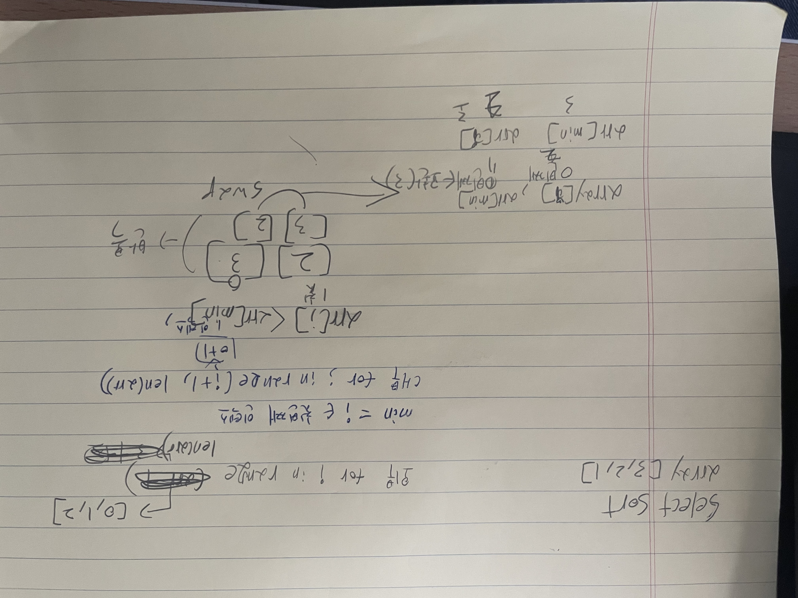
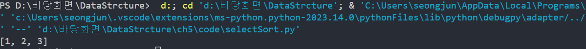
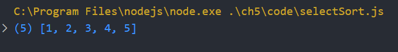
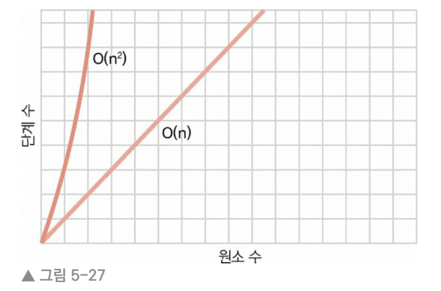
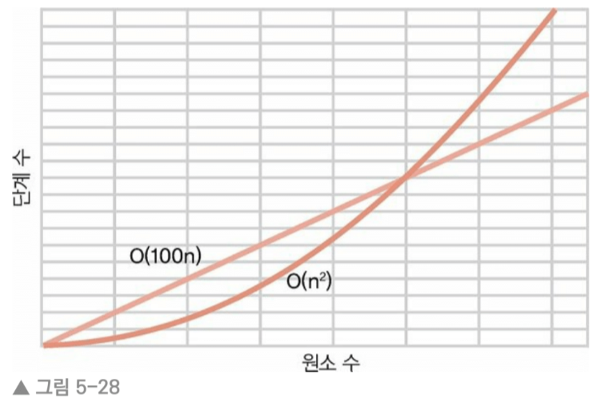
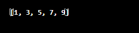

## 5.1 선택 정렬
📀 선택 정렬(selection sort)이라는 또 다른 정렬 알고리즘을 알아보자! 

1. [2,6,1,3] 의 배열에 최솟값을 구하는데 각 셀을 왼쪽부터 오른쪽 방향으로 확인하면서 
   가장 작은 값을 변수에 저장한다. 변수에 들어있는 값보다 작은 값이 들어 있는 셀을 
   만나면 변수가 새 인덱스를 가리키도록 값을 대체한다. 
   [2,6,1,3] ⏩ [2] 가 현재 최솟값 
   [2,6,1,3] ⏩ [6]이기 때문에 [2]가 현재 최솟값
   [2,6,1,3] ⏩ [1]이기 때문에 [1]로 변수 변경 
   [2,6,1,3] ⏩ [3]이기 때문에 [1]이 최종 최솟값 

2. 이제 최솟값이 3인덱스에 있는 것을 알았으므로 그 인덱스의 값과 패스스루를 
    처음 시작했을 때의 값을 교환한다. 
    [2,6,1,3] [2]와 [1] 위치 변경 

3. 데이터가 모두 정렬될 때까지 1, 2단계를 반복 

## 5.2 선택 정렬 실제로 해보기 
🧊 배열 [4,2,7,1,3]을 예제로 수행 

1. [4,2,7,1,3] ⏩ [4]가 현재 최솟값 옆에 [2]를 비교 
               ⏩ [4]보다 [2]가 작기 때문에 [2]가 최솟값 
               
2. [4,2,7,1,3] ⏩ [2]가 현재 최솟값 옆에 [7]를 비교
               ⏩ [7]보다 [2]가 작기 때문에 [2]가 최솟값 

3. [4,2,7,1,3] ⏩ [2]가 현재 최솟값과 [1]를 비교
               ⏩ [2]보다 [1]이 작기 때문에 [1]이 최솟값            

4. [4,2,7,1,3] ⏩ [1]이 현재 최솟값과 [3]을 비교
               ⏩ [3]보다 [1]이 작기 때문에 [1]이 최종 최솟값

5. [4,2,7,1,3] ⏩ [1]이 현재 최솟값이므로 인덱스 0과[4] 교환 
               ⏩ [1,2,7,4,3] 
               ✅ 인덱스 0은 정렬됐으므로 두 번째 패스스루는 다음 셀인 인덱스 1 부터 시작       

6. [1,2,7,4,3] ⏩ [2]가 현재 최솟값이므로 [7]과 비교  
               ⏩ [7]보다 [2]가 작기 때문에 [2]가 최솟값  

7. [1,2,7,4,3] ⏩ [2]가 현재 최솟값이므로 [4]와 비교  
               ⏩ [4]보다 [2]가 작기 때문에 [2]가 최솟값

8. [1,2,7,4,3] ⏩ [2]가 현재 최솟값이므로 [3]와 비교  
               ⏩ [3]보다 [2]가 작기 때문에 [2]가 최솟값
               ✅ 배열의 끝으로 도달해서 두 번째 패스스루가 끝남 

9. [1,2,7,4,3] ⏩ [7]이 현재 최솟값이므로 [4]와 비교  
               ⏩ [7]보다 [4]가 작기 때문에 [4]가 최솟값  

10.[1,2,7,4,3] ⏩ [4]가 현재 최솟값이므로 [3]과 비교  
               ⏩ [4]보다 [3]이 작기 때문에 [3]이 최솟값

11.[1,2,7,4,3] ⏩ [3]이 현재 최솟값이고 최종 배열에 도착함  
               ⏩ [3]과 세번째 패스스루 시작했던 값 [7]과 교환 
               ⏩ [1,2,3,4,7]
               ✅ 이제 배열이 올바른 위치에 있지만 컴퓨터는 몰라.. 네 번째 패스스루 돌려야 함 

12.[1,2,3,4,7] ⏩ [4]가 현재 최솟값이고 [7]과 비교   
               ⏩ [7]보다 [4]가 작기 때문에 [4]가 최솟값
               ✅ [1,2,3,4,7] 완성!                         
                               

## 5.3 선택 정렬 구현 
🧊 구현 

### PY 코드 selection Sort 
def selection_Sort(array): 
    for i in range(len(array)):
        minn = i
        for j in range(i+1, len(array)):
            if array[j] < array[minn]:
                minn = j
        array[i], array[minn] = array[minn], array[i]

array = [3,2,1]
selection_Sort(array)
print(array)

### JS 코드 selection Sort 
// selection Sort 
function selectionSort(array) {
    // 외부 for 문 
    for(var i = 0; i < array.length; i++){
        // 첫 번째 인덱스 
        var lowestNumberIndex = i;
        // 내부 for 문 
        // 두 번째 index를 첫 번째 index 비교 
        // 첫 번째 index가 두 번째 index보다 크면 lowestNumberIndex에 두 번째 인덱스 저장  
        for(var j = i+1; j < array.length; j++){
            if(array[j] < array[lowestNumberIndex]){
                lowestNumberIndex = j;
            }
        }
        // 첫 번째 인덱스랑 low 변수가 다르면 교환 
        // 첫 번째 인덱스에 temp 변수에 저장 
        // low 변수를 첫 번째 인덱스에 저장 
        // temp에 저장된 변수를 low에 저장  
        if(lowestNumberIndex !=i){
            var temp = array[i];
            array[i] = array[lowestNumberIndex];
            array[lowestNumberIndex] = temp;
        }
    }
    // 반환 
    return array; 
}

var arr = [4,5,3,1,2]
selectionSort(arr)
console.log(arr)

## 5.4 선택 정렬의 효율성
🧊 선택 정렬은 비교와 교환, 두 종료의 단계를 포함한다. 
   각 원소를 현재까지 찾은 최솟값과 비교하고, 
   최솟값을 올바른 위치에 있는 수와 교환 

✅ 비교 
5개의 원소를 포함하는 배열 예제로 돌아가면 총 10번 비교 

패스스루 번호         비교 횟수
1                    4번 
2                    3번
3                    2번
4                    1번 

따라서 총 4 + 3 + 2 + 1 = 10번의 비교 
원소 N개가 있을 때 (N-1) + (N-2) + (N-3) ... + 1번의 비교 

✅ 교환 
교환은 한 패스스루 당 최대 한 번 일어난다. 

💿 버블 정렬과 선택 정렬 비교 

N개의 원소      버블 정렬에서 최대 단계 수       선택 정렬에서 최대 단계 수 
5              20                             14(10번의 비교 + 4번의 교환)
10             90                             54(45번의 비교 + 9번의 교환)
20             380                            199(180번의 비교 + 19번의 교환)
40             1560                           819(780번의 비교 + 39번의 교환)
80             6320                           3239(3160번의 비교 + 79번의 교환)

⏩ 선택 정렬은 분명 버블 정렬보다 단계 수가 반 정도 적다. 
✅ 즉, 선택 정렬이 두 배로 더 빠르다. 

## 5.5 상수 무시하기
빅 오 표기법은 데이터 원소 수에 비례해 얼마나 많은 단계 수가 필요한가를 기술한 것 
따라서 선택 정렬의 단계 수가 N(2)의 반
O(N(2)/2)로 설명하면 적당할 듯하다. 
즉, 데이터 원소 N개가 있을 때 N(2) / 2단계가 필요하다. 

N개의 원소      N(2)/2             선택 정렬에서 최대 단계 수 
5              5(2)/2 = 12.5       14
10             10(2)/2 = 50        54 
20             20(2)/2 = 200       199
40             40(2)/2 = 800       819 
80             80(2)/2 = 3200      3239 

하지만 빅 오로 표현하면 O(N(2))이다 
😎 왜 그럴까?? 바로 빅 오의 규칙이다 

🥞 빅 오 표기법은 상수를 무시한다. 
   빅 오 표기법은 지수가 아닌 수는 포함하지 않는다는 것을 단순히 수학적으로 표현함 
   O(N(2))이다. 비슷하게 O(2N)도 O(N)이고, O(N/2)도 O(N)이다.
   O(N)보다 100바나 느린 O(1OON)이라 해도 마찬가지로 O(N)이다. 

그래고.. 선택 정렬이 더 나은 선택이다 흠.. ? 

## 5.6 빅 오의 역할
어느 정도 크기의 데이터에 대해서는 O(N)이 항상 O(N(2))보다 빠르다 
O(N)과 O(N(2))를 비교하는 그래프를 보자 

어떤 데이터 크기에서든 O(N)이 O(N(2))보다 빠름을 보여준다. 

두번째 그래프를 보자 O(N(2))와 O(100N) 비교! 

어떤 크기의 데이터에 대해서는 O(N(2))이 O(1OON)보다 빠르지만 
특정 시점을 지나면서 O(1OON)이 더 빨라진다. 

✅ 빅 오는 특정 시점부터 어떤 유형이 다른 유형보다 속도가 빨라지고
    이후로도 계속해서 더 빠른 경우 두 유형을 다르게 분류하고자 한다. 
    따라서 O(1OON) 같은 유형은 없고 O(N)이라고 쓸 뿐이다. 
    ⏩ 속도: O(log N) > O(N) > O(N(2))
## 5.7 실제 예제 
[✅] 예제 1 
def ever_other(array)
    new_array = []

    array.each_with_index do |element, index|
        new_array << element if index.even?
    end

    return new_array
end 

input_array = [1, 2, 3, 4, 5, 6, 7, 8, 9, 10]
result_array = ever_other(input_array)
puts result_array.inspect

🥞 위의 코드는 입력받은 배열의 각 원소를 순회하며 그 원소의 인덱스가 
   짝수인 경우에만 새 배열에 원소를 추가함 
   새 배열에는 두 원소마다 하나씩의 원소만 삽입하므로 N/2번의 삽입 수행 
   알고리즘의 효율성을 O(1.5N)이라고 말할 수 있다. 
   하지만 빅 오 표기법은 상수가 무시하므로 이 알고리즘은 O(N)

[✅] 예제 2 

def ever_other(array)
    new_array = []
    index = 0

    while index < array.length
        new_array << array[index]
        index += 2
    end
    
    return new_array
end

🥞 위의 코드는 원소를 하나씩 확인하는 대신 while을 사용해 건너 뛰며 읽는다 
    이로써 원소가 N개일 때 N/2번의 룩업과 N/2번의 새로운 배열로의 삽입을 수행함 
    첫 번째 구현처럼 이 알고리즘도 O(N)이다. 

## 5.8 마무리 
🧊 이제 자유자재로 쓸 수 있는 매우 강력한 분석 도구들이 생겼다!! 