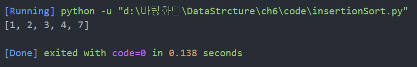
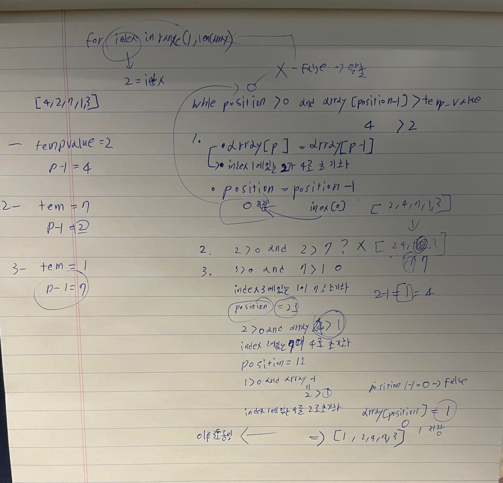

## 6.1 삽입 정렬
🧊 삽입 정렬(insersion sort)을 알아보자.

[✅] 삽입 정렬의 수행 순서 
1. 첫 번째 패스스루에서 임시로 인덱스 1의 값을 삭제하고 
   이 값을 임시 변수에 저장한다. 인덱스 1에 값이 없으므로 공백이 생김
   [8,4,2,3] => 4를 ❌
   [8, ,2,3], 임시 변수 = 4 
   이후 각 패스스루마다 다음 인덱스 값을 삭제함 

2. 다음으로 공백 왼쪽에 있는 각 값을 가져와 임시 변수에 있는 값과 비교하는 시프트 단계를 시작 
   [8, ,2,3] 공백 왼쪽에 있는 값이 임시 변수에 있는 값 보다 크면 그 값을 오른쪽으로 시프트 
   ⏩ 8은 4보다 크니 [ ,8,2,3] 형태로 된다. 

3. 이제 임시로 제거한 값을 현재 공백에 삽입한다. 
   [4,8,2,3]

4. 배열이 완전히 정렬될 때까지 1단계부터 3단계를 반복한다. 

## 6.2 삽입 정렬해보기
🧊 배열 [4,2,7,1,3] 을 삽입 정렬해보자. 

[✅] 인덱스 1의 값을 확인하며 첫 번째 스루를 시작해보자 
    [4,2,7,1,3] 배열에는 2가 들어있다. 
    임시로 2를 삭제하고 temp 변수에 저장한다. 
    [4],[0],[7],[1],[3]
    temp = [2]

1. [4]와 temp[2]를 비교한다. 

2. [4]가 [2]보다 크므로 4를 오른쪽으로 시프트한다. 
   [0],[4],[7],[1],[3]

3. temp를 다시 배열에 삽입해서 첫 번째 패스스루를 끝낸다. 
   [2],[4],[7],[1],[3]

[✅] 두 번째 패스스루에서는 인덱스 2의 값을 임시로 삭제하고 temp에 저장 
     [2,4,0,1,3] temp = 7 

4. [4]와 temp 7을 비교한다 4가 더 작으므로 시프트 단계를 끝낸다. 

5. temp를 다시 공백에 삽입하고 두 번째 패스스루는 끝낸다.
   [2,4,7,1,3]

[✅] 세 번째 패스스루에서는 인덱스 3의 값을 임시로 삭제하고 temp에 저장 
     [2,4,7,0,3] temp = 1 

6. [7]과 temp를 비교한다. 

7. [7]은 1보다 크므로 7을 오른쪽으로 시프트 
   [2,4,0,7,3]

8. [4]와 temp를 비교 

9. [4]가 1보다 크므로 4를 오른쪽으로 시프트 
   [2,0,4,7,3]

10. [2]와 temp를 비교 

11. [2]가 1보다 크므로 2를 오른쪽으로 시프트
    [0,2,4,7,3]

12. 공백이 배열의 왼쪽 긑에 있으므로 temp를 공백에 삽입하고 패스스루 끝냄
    [1,2,4,7,3]

[✅] 네 번째 패스스루는 인덱스 4의 값을 삭제하고 temp에 저장 
      [1,2,4,7,0] temp = [3]

13. [7]을 temp와 비교 

14. [7]이 3보다 크므로 7을 오른쪽으로 시프트 
    [1,2,4,0,7]

15. [4]와 temp를 비교 

16. [4]가 3보다 크므로 4을 오른쪽으로 시프트 
    [1,2,0,4,7]

17. [2]와 temp 비교 [2]는 3보다 작기 때문에 시프트 종료 

18. [3]을 공백에 다시 삽입 
    [1,2,3,4,7]

🐸 배열 정리 완료! 

## 6.3 삽입 정렬 구현

def insertion_Sort(array):
    # index 1 부터 시작하고 전채 배열을 순회 
    for index in range(1, len(array)):
        # index를 position에 할당
        # index에 있는 값을 temp_value에 저장 
        position = index
        temp_value = array[index]
        # postion이 index 0보다 (index 0번쨰)랑 왼쪽 값이 temp에 넣은 변수보다 클 경우 
        while position > 0 and array[position - 1] > temp_value:
            # postion에 왼쪽 값을 저장 
            array[position] = array[position - 1]
            # postion은 -1로 index 낮추기 
            position = position - 1
        # index 0 나오면 while 탈출로 시프트 연산 끝 
        # temp 값 postion에 저장 
        array[position] = temp_value

arr = [4, 2, 7, 1, 3]
insertion_Sort(arr)
print(arr)

🧊 결과 

 
 

💿 공부 

## 6.4 삽입 정렬의 효율성
🐸 삽입 정렬에 포함된 단계는 삭제, 비교, 시프트, 삽입, 네 중료다. 

📀 비교 
비교는 공백 왼쪽에 있는 값과 temp를 비교할 때마다 일어난다. 
배열이 역순으로 정렬된 최악의 경우 각 패스스루마다 왼쪽에 있는 모든 수를 tmep와 비교해야 함 
따라서 각 패스스루는 공백이 배열의 왼쪽 끝으로 가야만 끝난다. 

index 1인 경우 최대 1번의 비교 
index 2인 경우 최대 2번의 비교 
다시 말해 배열에 원소 n개가 있으면 마지막 패스스루에는 최대 N-1번의 비교가 일어남 
1+2+3+...+N-1 번의 비교 
원소가 열 개인 배열이면 1+2+3+4+5+6+7+8+9 = 45번의 비교가 있을 것이다. 

이러한 패턴은 대략 N(2)/2번의 비교가 일어난다. 

📀 시프트
값을 한 셀 오른쪽으로 옮길 때마다 일어난다. 배열이 역순으로 정렬돼 있다면 비교가 일어날 때마다 
값을 오른쪽으로 시프트해야 하므로 비교 횟수만큼 시프트가 일어난다. 

최악의 시나리오일 때 비교와 시프트 횟수를 합쳐보면 
N(2)/ 비교 2번  + N2/ 시프트 2번 = N(2)단계
배열로부터 temp를 삭제하고 다시 삽입하는 작업은 패스스루 당 한 번 일어난다. 
패스스루는 항상 N-1번이므로 결국 N-1번의 삭제와 N-1번의 삽입이 있을 것이다. 

비교와 시프트를 합쳐서 N(2)번 
+ 삭제 N-1번
+ 삽입 N-1번 
-------------------
N(2) + 2N-2단계 

빅 오에는 상수를 무시하기 때문에 O(N(2)+N)으로 단순화 시킬 수 있음 
바로 O(N(2))로 

⏩ 결론적으로 최악의 시나리오에서 삽입 정렬, 버블 정렬, 선택 정렬 시간 복잡도가 같음 
   셋 모두 O(N(2))이다.  

## 6.5 평균적인 경우
🐟 평균 시나리오도 고려해보자

🧪 그래프

최선의 그리고 최악의 시나리오는 드물게 발생 
실제로는 평균시나리오가 발생한다. 

최악의 시나리오에서는 모든 데이터를 비교하고 시프트하고
최선의 시나리오에서는 어떤 데이터도 시프트하지 않지만 
평균 시나리오에서는 대체적으로 데이터의 반을 비교하고 시프트 한다. 

따라서 삽입 정렬이 최악의 시나리오에서 N(2)단계가 걸린다면 평균 시나리오에서는 약 N(2)/2 단계가 걸림 

🐧 삽입 정렬은 시나리오에 의해서 성능이 크게 자우된다. 
🐟 최악 N(2)
🐟 평군 N(2)/2
🐟 최선 N 
이렇게 서로 다른 이유는 어떤 패스스루는 temp 왼쪽의 모든 데이터를 비교하는 반면
어떤 패스스루는 temp보다 작은 값을 만나면서 패스스루가 일찍 종료되기 때문이다. 

🧪 세 종류의 성능 그래프 

위 그래프를 선택 정렬과 비교하면 선택 정렬은 최악, 평균, 최선 모두 N(2)/2단계가 걸린다. 
선택 정렬에는 어떤 시점에 미리 패스스루를 끝낼 매커니즘이 전혀 없기 때문이다. 

## 6.6 실제 예제 
🍹 두 배열의 교집합을 구하는 코드를 작성해보자~ 
    교집합은 두 배열에 모두 들어 있는 모든 값들의 리스트이다. 
    예를 들어 [3,1,4,2]와 [4,5,3,6]일때 교집합은 [3,4]라는 새로운 배열이다.

🧪 실험
// intersection
function intersection(first_array, second_array){
    var result = [];

    for (var i = 0; i<first_array.length; i++){
        for (var j = 0; j<second_array.length; j++){
            if(first_array[i]==second_array[j]){
                result.push(first_array[i]);
            }
        }
    }
    console.log(result)
    return result;
}
var a = [3, 1, 4, 2]
var b = [4, 5, 3, 6]
intersection(a, b)

🧪 결과

두 배열이 크기가 같다면 N(2)번의 비교를 수행한다. 
첫 번째 배열의 각 원소에 대해 두 번째 배열의 각 원소를 비교하기 때문이다. 
따라서 이러한 알고리즘의 효율성은 O(N(2))이다. 

🐟 알고리즘 향상시킬 방법은 없나? 
    break; 넣으면 끝 ㅋㅋㅋㅋ 
    어차피 [i] 는 정해져 있으니깐 똑같은거 나오면 바로 탈출시키면 댐 
🧊 이제 성능은 N과 N(2) 사이쯤일 것이다.. 

## 6.7 마무리
💿 명심하자 최악의 경우를 대비하는 것도 좋지만 대부분은 평균적인 경우가 
    일어난다는 점을 명심하자! 
    